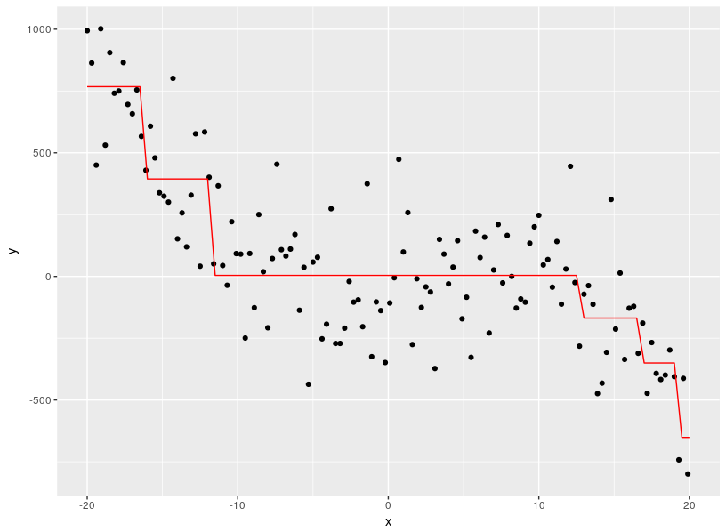
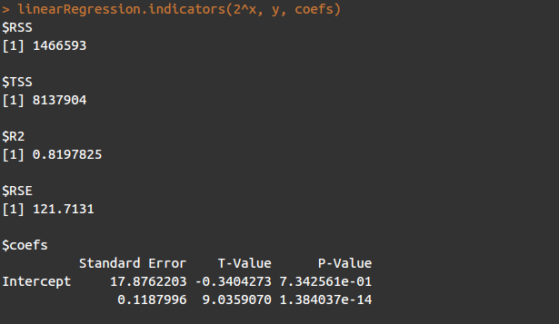
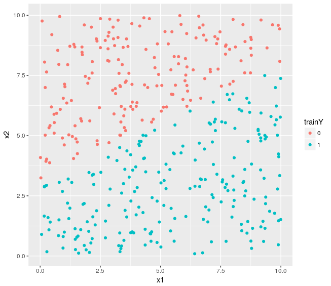
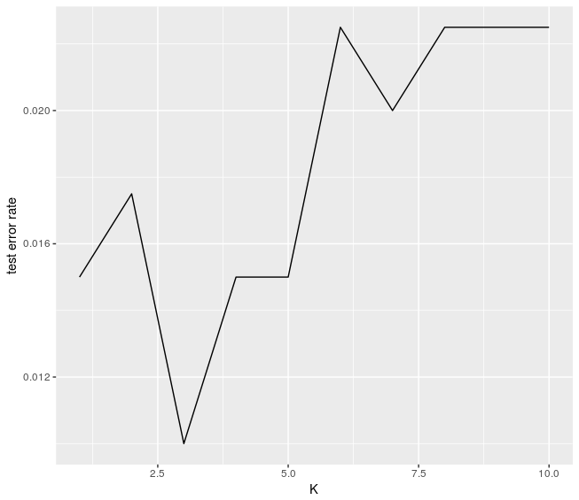
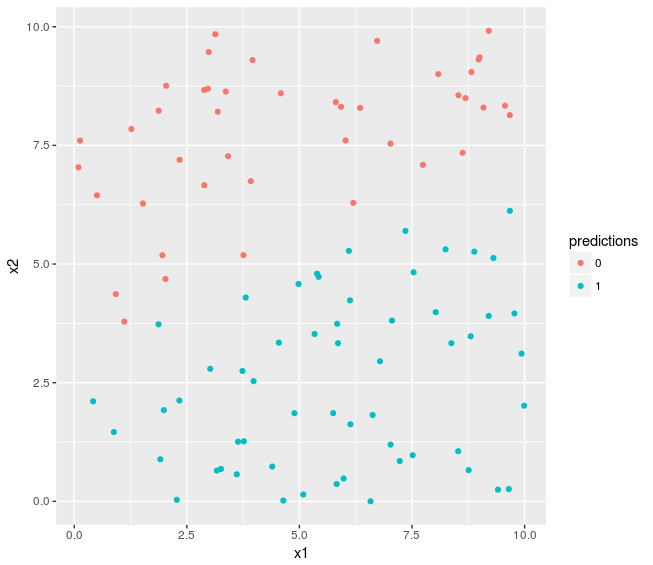

Here are some attempts of statistical learning algorithms implementation, just for learning and understanding purpose, and mainly inspired by the book "An Introduction to Statistical Learning". It surely contains some mistakes, feel free to report them !

- [Decision Tree (Regression)](#decision-tree-regression)
- [K-means clustering](#k-means-clustering)
- [Multiple linear regression](#multiple-linear-regression)
- [k-nearest-neighbors](#k-nearest neighbors)

## Decision Tree (Regression)

Decision trees can be used for both regression and classification. Here is an implementation for regression that could further be extended to classification. Below is an example of decision tree built from a single predictor and a quantitative variable :

Decision Tree :

Training data and predictions chart :

## K-means clustering

K-means is a clustering algorithm. That is, finding K homogeneous clusters of observations within the dataset. Here is a example of clustering performed on a dataset that contains two variables, with k = 3.

Dataset before K-means clustering :

Dataset after K-means clustering :

## Multiple linear regression

Multiple linear regression is maybe the most basic statistical learning algorithm for predicting quantitative responses. I use Ordinary least squares method to estimate the parameters. Here is an example performed on a dataset that contains one variable with an exponential shape :

linearRegression.indicators() function allows to get some statistical data over the model. The standard error for the coefficients is computed by generating several bootstrap sample datasets.

## k-nearest neighbors

k-nearest neighbors can be used to predict quantitative and qualitative responses by picking up the K nearest neighbors for a given observation and then estimate the response by averaging the neighbors response in case of a quantitative variable - or taking the most frequent response for a categorical one. 
knn.cv() function allows to choose the best K value by performing cross-validation on a range of values for K (from 1 to 10 by default). It performs a 10-folds CV by default.
Here is an example performed on a dataset that contains 2 predictors, a qualitative variable of two levels and k=3.

Traning dataset :

Test dataset with predicted responses for k=3 :

